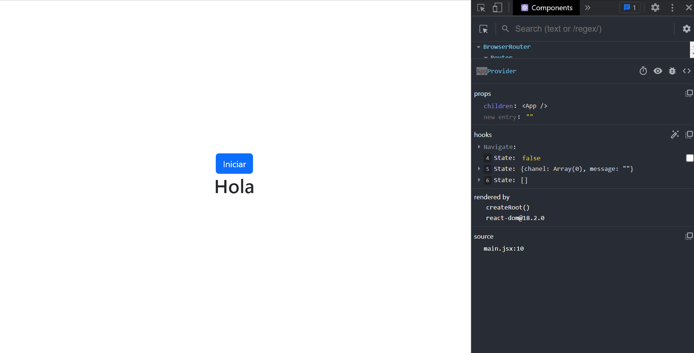
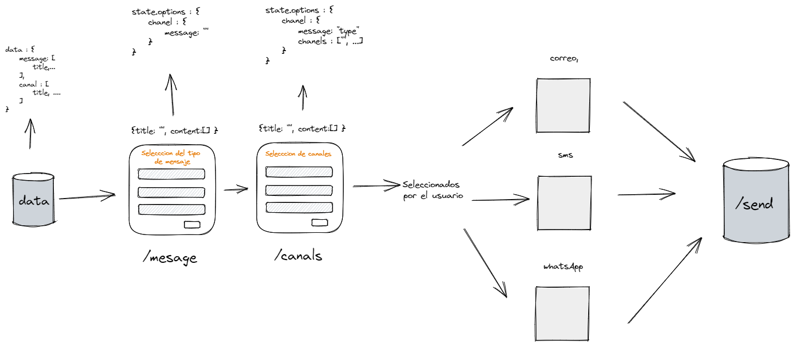

# Modal Card

El proyecto dejado como reto para la clase

## Preview


## Model Abstraction



## Proyecto en vivo

https://stevennizamamartinez.github.io/krowdi-modal/

## Getting Started

Instrucciones básicas para usar el proyecto

### Installing

Clona el repositorio del proyecto en tu máquina local. Puedes hacerlo usando el siguiente comando en tu terminal:

```
git clone https://github.com/StevenNizamaMartinez/krowdi-modal
```

Luego ejecuta el siguiente comando en la ruta raiz del proyecto

```
npm install
```

Finalmente inicia el proyecto con el comando 

```
npm run dev
```

## Visita mi portafolio 

https://portfolio-stevennizama.netlify.app/


